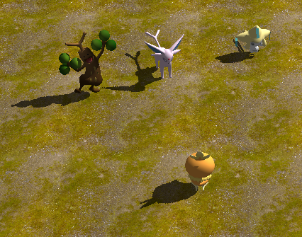

# Implementing Pokemon mechanisms in OpenGL / C++

## Table of contents
* [General info](#general-info)
* [Topics covered](#topics-covered)

## General info
An implementation of a Pokemon-like game in OpenGL using C++ for a university semester project. The purpose of this project was to get a hands-on experience on graphics programming, outlining its  most important aspects. Having no prior experience on graphics programming or C++, I took the learning approach of learnopengl.com to get acquainted with the basics, and then step on these foundations to get creative.

The project simulates a character moving inside a bordered-by-trees environment (just like Pokemon games usually do), in a third-person perspective. The character is able to throw/use Pokeballs, which make a Pokemon appear after colliding with the environment, while also being able to recapture them.

Further steps that I didn't have time to complete: 
- Particle system to simulate Pokemon attacks
- VFX for when the Pokemon appear or are recaptured
- Other aesthetic upgrades

## Topics covered

* Setting-up Scene:
>   Shaders,
	Camera,
	Skybox,
	Terrain,
	Model loading: Assimp.
	

* Lighting/Shadows
>	Blinn-Phong Lighting,
	Shadow Mapping.

* Physics
>	Rigidbody,
	Collisions.
	

	
* User Inputs:
> 	Movement,
	Pokeball throwing,
	Raycasting.
	

